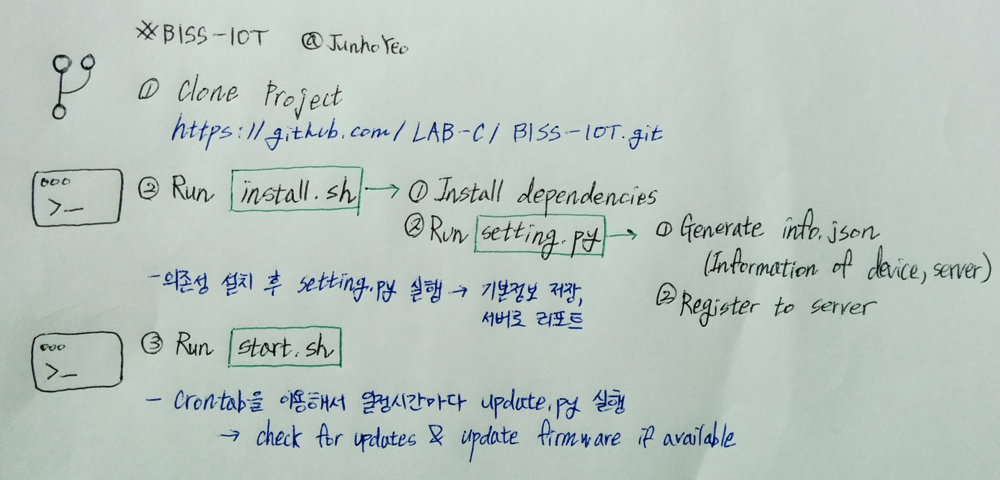

# BISS-IOT

## Basic Concept


## Usage

### 0. Run install.sh
	sudo ./install.sh 
- Install dependencies

>caver-js,nodejs,arduino,arduino-sketch 

- Generate `info.json`
    - `device`: Device infomation
    - `name`: Used in device identification
    - `wallet`: Device Klaytn wallet address
    - `klaytn-node`: URL of running Klaytn node
    - `firmware-server`: URL of running [Firmware-server](https://github.com/junhoyeo/BISS-FirmwareServer)

```json
// info.json
{
    "device": {
        "name": "somedevice1",
        "wallet": "0x75a59b94889a05c03c66c3c84e9d2f8308ca4abd"
    },
    "klaytn-node": "http://ubuntu.hanukoon.com:8551/",
    "firmware-server": "http://ubuntu.hanukoon.com:5000/"
}
```

- Register to server(POST to `/register`)

## 2. Check server API with interval

- Send device wallet in `/check/update`

## 3. If `Update available`
pass

## 4. If U want run background?
	sudo ./start.sh
--
# More information! 
~~(Too Much Infromation maybe?)~~

### 1. `klaytn.py`를 쓰자~!
```python
from klaytn import *

klay = Klaytn("클레이튼서버주소")
```

프로젝트 폴더에는 (`caver-js`가 설치된)`node_modules`, `blockchain` 폴더와 `klaytn.py`, `send.js`가 있어야 한다.
 
새 파이썬 스크립트를 작성하고 위와 같이 config한다. `example.py`를 이용하면 쉽게 개발할 수 있다.

### 2. 지갑을 생성하자.
```python
wallet = klay.newAccount('암호')
```
패스프레이즈가 `_labc`인 새로운 어카운트를 만든다. 지갑을 생성할 때 자동으로 faucet를 돌려서 1000klay를 저장한다(gas 비용이 필요하므로).

`klay.newAccount()`는 지갑 주소를 반환한다.
>여러번 만들면 제제를 받을수도있다! 꼭 한번만들고 기록해두자!

### 3. 어카운트를 언락하자.
```python
klay.unlockAccount(wallet, '_labc', 30000))
```

패스프레이즈가 `암호` 인 wallet이라는 지갑주소를 언락한다. 마지막 인수는 언락 기간(초)이다. 즉 위 예제의 wallet은 30000초 동안 언락되고 그 이후에는 다시 lock된다.
>아무도 관심없겠지만 아마 영어만 패스프레이즈로 사용가능한걸로 안다.

### 4. 데이터를 보내자.
```python
print(klay.sendData(wallet, 'so what?'))
```
>너무쉽자너?

### 5. 그럼 어캐 데이터를 꺼내냐고?

```js
var Caver = require('caver-js');
var caver = new Caver('http://klaytn.ngrok.io');

var transactionHash = '0xe1c47ed7dcdc757bb73cee22d118ef0a3f4c126deae8b88b811a71d76f0704ba';
caver.klay.getTransaction(transactionHash).then(function(transaction) {
    console.log(caver.utils.hexToAscii(transaction.input).trim().replace('6FÐ!', ''));
});
```

데이터를 꺼내하고싶어하는 친구는 아마도(?) txHash(`transactionHash`)를 알고 있으니까 이를 이용해서 input data를 구하고 정돈해주면 된다.

## Transaction Information API LINK

https://apiscope.klaytn.com/api/transaction/[txhash]